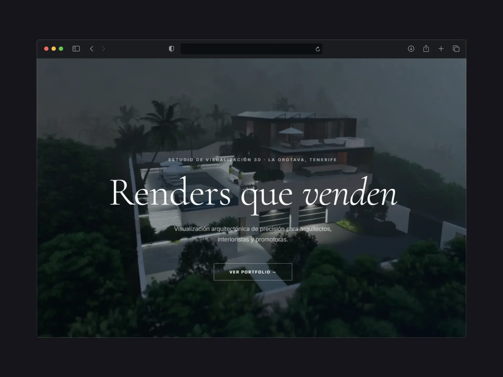

# Rendex — Estudio de Renders 3D Arquitectónicos

## Vista en vivo

> **[rendex-anders.vercel.app](https://rendex-anders.vercel.app)**

---

## Vista previa



---

## Descripción

Sitio web de portfolio y captación de clientes para **Rendex**, estudio especializado en renders 3D arquitectónicos ubicado en La Orotava, Tenerife. El objetivo del sitio es transmitir calidad visual premium y convertir visitas en presupuestos solicitados.

---

## Arquitectura

### Stack tecnológico

| Capa                | Tecnología                                                       |
| ------------------- | ---------------------------------------------------------------- |
| Framework           | [Astro 6](https://astro.build) — generación estática             |
| Lenguaje            | TypeScript (modo estricto)                                       |
| Estilos             | CSS vanilla — sin frameworks de utilidades                       |
| Tipografías         | Cormorant Garamond (titulares) + Inter (cuerpo) via Google Fonts |
| Gestor de paquetes  | pnpm                                                             |
| Runtime mínimo      | Node.js ≥ 22.12.0                                                |
| Email transaccional | [Formspree](https://formspree.io) — envío directo sin backend    |
| Imágenes            | `astro:assets` + Sharp — conversión automática a WebP            |
| Sitemap             | `@astrojs/sitemap` — generado en cada build                      |

### Estructura de carpetas

```
Rendex/
├── public/
│   ├── favicon.png
│   └── robots.txt
├── src/
│   ├── assets/              # Imágenes originales (procesadas por Astro → WebP)
│   ├── components/
│   │   ├── Nav.astro
│   │   ├── Hero.astro
│   │   ├── Portfolio.astro
│   │   ├── Services.astro
│   │   ├── Testimonials.astro
│   │   ├── Contact.astro
│   │   ├── Footer.astro
│   │   └── CookieBanner.astro
│   ├── layouts/
│   │   └── Layout.astro
│   └── pages/
│       ├── index.astro
│       ├── politica-de-privacidad.astro
│       ├── politica-de-cookies.astro
│       └── aviso-legal.astro
├── astro.config.mjs
├── tsconfig.json
└── package.json
```

### Modelo de página

El sitio es una **Single Page Application con anclas** (`#portfolio`, `#servicios`, `#resenas`, `#contacto`). El navegador hace scroll suave entre secciones sin recargar. El formulario de contacto envía directamente a [Formspree](https://formspree.io) desde el cliente — no requiere backend ni SSR.

---

## SEO

### Meta tags y Open Graph

Definidos en `src/layouts/Layout.astro` y aplicados en todas las páginas:

- `<title>` — "Renders 3D Arquitectónicos en Tenerife | Rendex"
- `<meta name="description">` — descripción optimizada para el negocio local
- `<link rel="canonical">` — URL canónica apuntando a `https://rendex.es`
- Open Graph completo: `og:title`, `og:description`, `og:image` (1200×630), `og:url`, `og:locale="es_ES"`, `og:site_name`
- Twitter Card: `summary_large_image` con título, descripción e imagen

### Datos estructurados (Schema.org JSON-LD)

Implementado el tipo **LocalBusiness** con nombre, teléfono, email, dirección y coordenadas geográficas. Permite aparecer en el **Knowledge Panel de Google** y en resultados de búsqueda local enriquecidos.

### Sitemap y robots.txt

Sitemap generado automáticamente en cada build por `@astrojs/sitemap` y publicado en `https://rendex.es/sitemap-index.xml`. Referenciado en `public/robots.txt`.

---

## Secciones de la web

| Sección         | Descripción                                                     |
| --------------- | --------------------------------------------------------------- |
| **Nav**         | Navegación sticky con scroll suave y menú hamburguesa en móvil  |
| **Hero**        | Pantalla completa con parallax, titular principal y CTA         |
| **Portfolio**   | Galería masonry de 9 imágenes (1 destacada 2×2)                 |
| **Servicios**   | 3 paquetes sin precio visible — CTA a solicitar presupuesto     |
| **Testimonios** | 3 reseñas de clientes sobre fondo oscuro                        |
| **Contacto**    | Formulario (Formspree) + email, teléfono, ubicación e Instagram |
| **Footer**      | Logo, enlaces legales y copyright                               |

---

## Desarrollo local

```bash
# Instalar dependencias
pnpm install

# Servidor de desarrollo
pnpm dev

# Build de producción
pnpm build

# Previsualizar build
pnpm preview
```

---

## Despliegue

Desplegado en **Vercel** conectando el repositorio directamente. Sitio 100% estático — no requiere adaptador ni variables de entorno. El formulario de contacto usa [Formspree](https://formspree.io) (endpoint `xjgzbgvj`, cuenta `info@rendex.es`).

---

## Licencia

Proyecto propietario — todos los derechos reservados © Rendex.

_Desarrollado por [Matus Behun](mailto:matusbehun03@gmail.com)_
